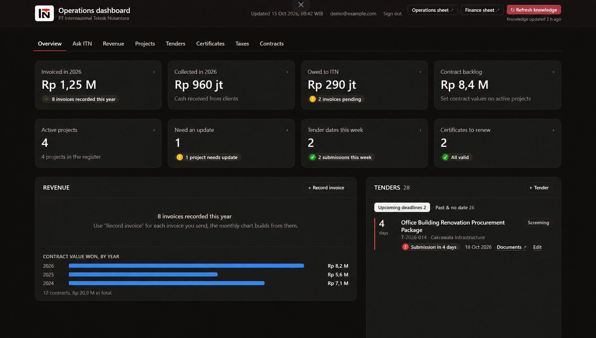
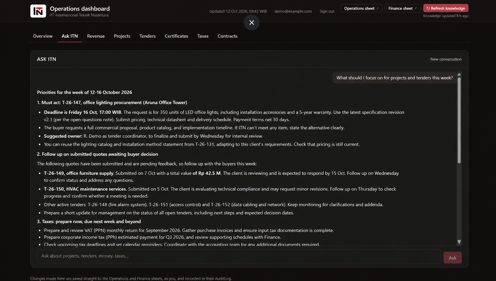
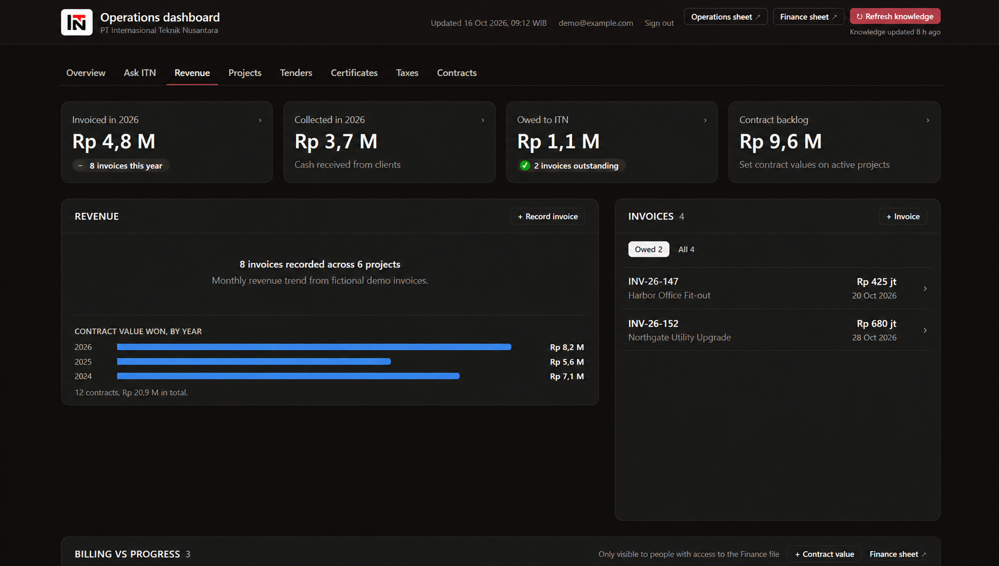
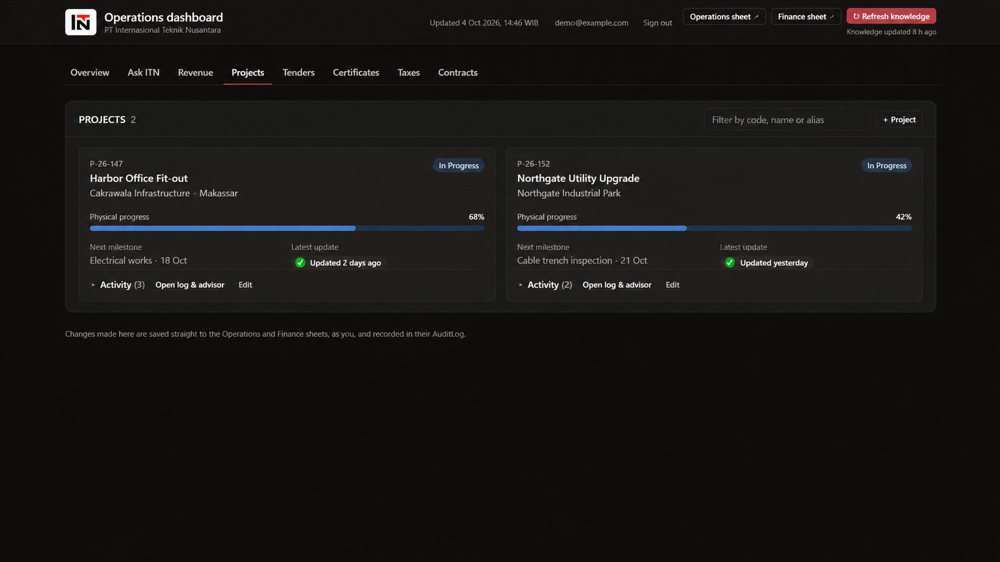
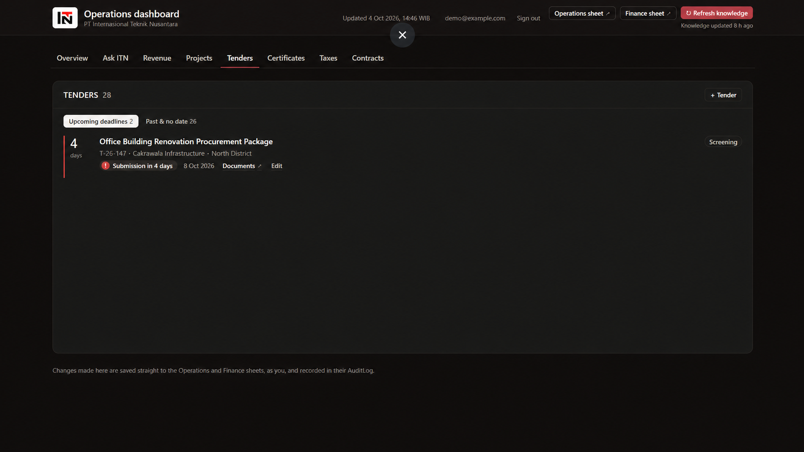
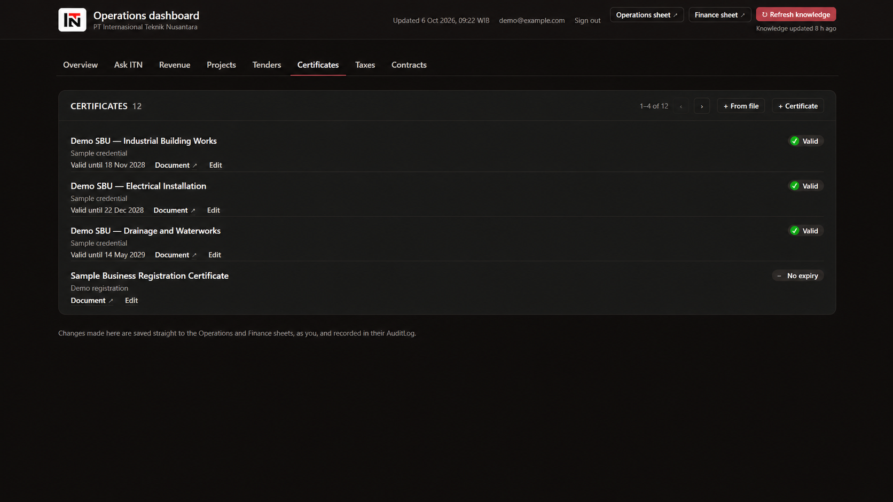
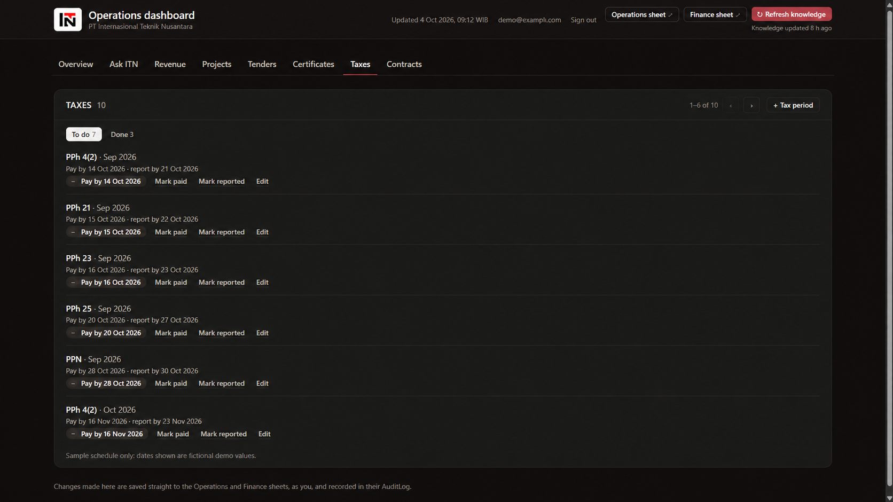
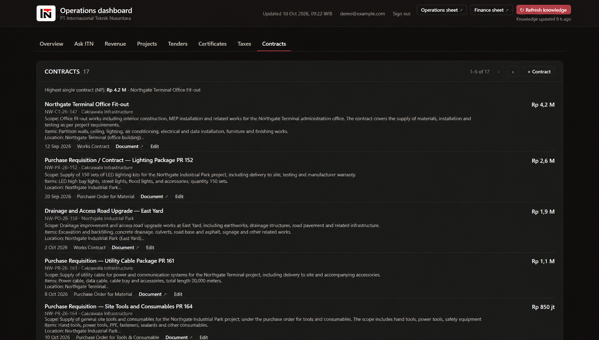
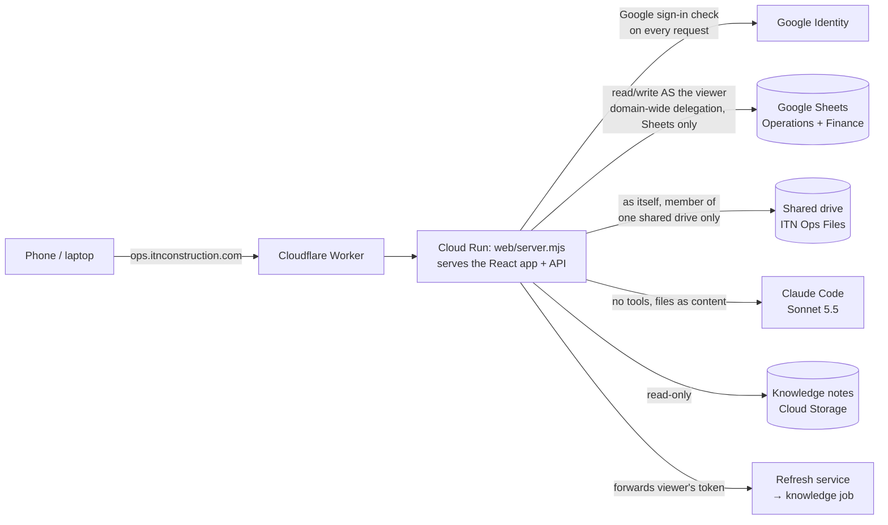

# ITN Ops Dashboard

**The operations dashboard of PT Internasional Teknik Nusantara (ITN)**, an Indonesian EPC and construction contractor: revenue, projects, tenders, certificates, taxes and contracts in one place, editable from a phone, with an AI advisor that knows the company's history.

Built and deployed in two days. Read the full story in **[CASE-STUDY.md](CASE-STUDY.md)** (written in the STAR format).

> This repository contains the **dashboard (frontend) and its server (backend)**. The knowledge pipeline, the Apps Script admin project and all deployment configuration live in a private repository. Everything shown in the local preview is **fictional sample data**.

The eight portfolio captures below preserve the dashboard’s original screens and use invented demo records, amounts, and dates. The local preview also uses fictional sample data; no production records are shown.

| Overview | Ask ITN |
|---|---|
|  |  |

| Revenue | Projects |
|---|---|
|  |  |

| Tenders | Certificates |
|---|---|
|  |  |

| Taxes | Contracts |
|---|---|
|  |  |

---

## What it does

| Area | Highlights |
|---|---|
| **Revenue** | Invoiced this year vs the same point last year, cash collected, money owed with overdue aging, contract backlog, month-by-month chart, contract value won by year, billed vs built per project |
| **Projects** | A page per project with an **activity log** (meetings, negotiations, site visits, milestones…) and **file attachments** stored in a shared drive; status, progress and next step updated from the same form |
| **AI** | **Drafts log entries and certificates from uploaded files** (PDF, photos, Word, Excel) for a person to confirm; an **advisor** on every project and across the business, answering from the records, the company knowledge base and recent attachments, **streamed** as it writes |
| **Taxes** | PPN, PPh 4(2), 21, 23, 25 and the annual return: periods created automatically, due dates filled in, alert banner and a counter on the tab; record payment (billing code, NTPN) and filing to clear them |
| **Tenders & certificates** | Upcoming deadlines first, expiry tracking, add a certificate straight from its scan |
| **Contracts** | The work-experience register: value, date, scope of work, signed document link; highest single contract (NPt) shown |
| **Editing** | Add, edit and delete every record type from the dashboard; every change and deletion goes to an audit log |

## Architecture



- **Google Sheets is the system of record.** The team already uses it, there is no database to run, and Google's file sharing stays the permission model.
- **The server acts as the signed-in person**, so it can never show or change more than that person could in Google Drive themselves. The Finance sections only appear for people who can open the Finance spreadsheet.
- **One pure, tested module** (`shared/Logic.js`) builds the dashboard data and plans every edit and deletion: whitelisted fields per record type, validation, duplicate detection, formula-safe writes. The same module runs in the server and in a Google Apps Script version of the dashboard.

## Security model

- **Sign-in:** Google Identity Services; the server verifies the ID token (issuer, audience, verified email, company domain) on every API call.
- **Least privilege:** delegated access is limited to Sheets scopes; file storage uses the service account's own identity, which is a member of one shared drive only and cannot permanently delete.
- **AI with no tools:** Claude Code runs in print mode with every tool, MCP server and settings file disabled. Uploaded documents are passed in as content blocks (PDFs and images directly; Word and Excel as extracted text), so a hostile document can only be read, never act. Answers render as text with a small Markdown subset, never HTML.
- **Writes can't become formulas:** text is written with `RAW`; only validated `YYYY-MM-DD` dates use `USER_ENTERED`.
- **Audit:** every add, edit, deletion and upload is appended to an owner-only AuditLog tab; deletions keep the full row.
- **Browser:** hash-pinned Content Security Policy (only the app's own script and Google sign-in), `frame-ancestors 'none'`, HSTS, `nosniff`.

## Tech stack

React 19 · TypeScript 5.9 · Tailwind CSS 4 · Vite 8 (single-file build) · Node.js 22 · `google-auth-library` · Google Sheets / Drive / IAM Credentials APIs · Google Cloud Run, Cloud Build, Secret Manager, Cloud Storage · Cloudflare Workers · Claude Code (Claude Sonnet 5.5) · `mammoth` (Word) · `exceljs` (Excel)

## Repository layout

```
dashboard-ui/        React + TypeScript app (Vite, Tailwind); builds to one self-contained HTML file
  src/demo/          Demo mode: fictional seed data, in-browser store (shared rules), demo login + AI client
api/                 Vercel functions for the demo: login (session token) and ask (Kimi, streamed)
vercel.json          Demo build, output folder, security headers
  src/components/    Pages and panels: revenue, invoices, taxes, projects (+ activity log), tenders,
                     certificates, contracts, advisor, edit dialog, sign-in
  src/mock.ts        Fictional sample data for the local preview
web/
  server.mjs         HTTP server: page + API (dashboard data, edits, deletions, log entries,
                     uploads, AI draft, AI ask with streaming), sign-in checks, audit log
  drive.mjs          Shared-drive folders and resumable uploads
  ai.mjs             Claude Code runner (no tools), file → content blocks, prompts
  test/              Server and AI-input tests (node:test, no network)
  Dockerfile         Multi-stage build: UI build, then the server with Claude Code
shared/Logic.js      Pure business logic: payload builder, tax rules, revenue, edit/delete planner
dashboard/src/Config.js  Sheet schemas and option lists
```

## Stakeholder demo (Vercel)

A self-contained demo of the same dashboard runs on **Vercel** with a **fictional company**:

- **No database.** The demo data (6 projects with activity logs, ~two years of invoices, taxes in every state, tenders, certificates, contracts) is generated in the browser relative to today, so deadlines and alerts always look current.
- **Same business rules as production.** Edits, deletions and log entries go through the real `planEdit` / `planDelete` / `validateLogEntry` in `shared/Logic.js`, and the screens are built by the real `buildDashboardPayload`. Each visitor's changes stay in their own browser; **Reset demo data** starts over.
- **Demo login.** A username and password checked by `api/login` (stored as Vercel environment variables, never in this repository), which issues a signed 12-hour session token.
- **AI advisor on the Kimi API** (`api/ask`, Moonshot's OpenAI-compatible endpoint), streamed back in the same NDJSON format as production. The API key stays on the server; answers are capped in length and per session per hour. Uploads and "draft from files" are simulated in the demo, so no real document is ever sent to an AI.

### Deploy it

1. Import this repository in Vercel (no framework preset). `vercel.json` sets the build (`npm --prefix dashboard-ui run build:demo`), the output folder and the security headers; `api/` becomes the two functions.
2. Add these environment variables in **Vercel → Project → Settings → Environment Variables**:

| Variable | Value |
|---|---|
| `KIMI_API_KEY` | Your Moonshot API key |
| `DEMO_USERNAME`, `DEMO_PASSWORD` | The login you give stakeholders |
| `DEMO_SESSION_SECRET` | A random string of 32+ characters (e.g. `openssl rand -hex 32`) |
| `KIMI_MODEL` *(optional)* | Pin a model; otherwise the demo asks Moonshot which models the key has and uses the first of `moonshot-v1-32k`, `moonshot-v1-auto`, `kimi-k2.5`, `kimi-k2.6`, … |
| `KIMI_MAX_TOKENS`, `DEMO_QUESTIONS_PER_HOUR` *(optional)* | Default 900 (4000 for thinking models) and 40 |

3. Redeploy. Run the demo locally with `npm --prefix dashboard-ui run dev:demo` (any login works locally; AI answers are placeholders without Vercel).

## Run the preview locally

The preview uses the fictional data in `dashboard-ui/src/mock.ts`; saves and AI answers are simulated.

```bash
cd dashboard-ui && npm install && npm run dev
```

Open http://localhost:5173. Useful pages: `#/overview`, `#/revenue`, `#/projects/P-2026-003`, `#/taxes`, `#/ask`.

## Tests

```bash
cd web && npm install && npm test
```

The business-logic suite (83 tests) lives with the shared module in the private repository; the suite here (9 tests) checks sign-in rules, the security headers, routing, how files are handed to the AI, and the demo's login and streamed Kimi answers against a fake API.

## Deploying (outline)

Build with `gcloud builds submit --config web/cloudbuild.yaml --substitutions _TAG=v1 .` and deploy the image to Cloud Run with:

| Variable | Purpose |
|---|---|
| `ITN_OAUTH_CLIENT_ID` | Google sign-in client (internal app) |
| `ITN_DOMAIN` | Company Google Workspace domain |
| `ITN_OPS_SPREADSHEET_ID`, `ITN_FINANCE_SPREADSHEET_ID` | The two spreadsheets |
| `ITN_DELEGATING_SERVICE_ACCOUNT` | Service account with domain-wide delegation (Sheets scopes) |
| `ITN_AUDIT_ACTOR` | Owner of the spreadsheets (writes the AuditLog) |
| `ITN_FILES_DRIVE_ID` | Shared drive for uploads |
| `ITN_STATE_BUCKET` | Bucket holding the knowledge notes |
| `ITN_REFRESH_URL` | Knowledge refresh service |
| `CLAUDE_CODE_OAUTH_TOKEN` | From Secret Manager |

---

© PT Internasional Teknik Nusantara. Shared as a portfolio piece; all rights reserved.
